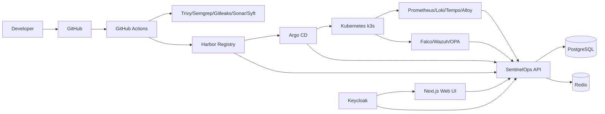
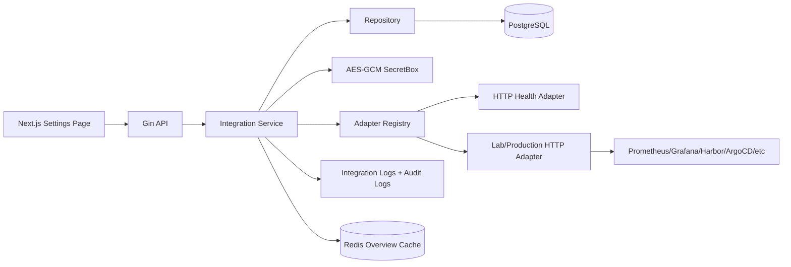

# SentinelOps Architecture

## Architectural Decision Summary

SentinelOps is built as a modular Internal Developer Platform control plane. The first runnable release focuses on the IDP application, API, data model, and integration boundaries rather than bundling every enterprise platform component into one local deployment.

This decision keeps the project beginner-friendly while preserving a production path for enterprise environments.

## System Context

SentinelOps connects these operational domains:

1. Developer workflow: source repositories, pull requests, CI/CD status, code quality, and scans.
2. Artifact lifecycle: container images, SBOM, vulnerability scan results, image signatures, and retention policy.
3. GitOps deployment: Argo CD sync, Kubernetes health, rollback, and environment drift.
4. Runtime observability: metrics, logs, traces, dashboards, and alerting.
5. Security and compliance: runtime threat detection, SIEM, WAF signals, policy enforcement, and audit logs.
6. Platform dashboard: unified operational state for developers, SREs, security engineers, and platform teams.

## Component Architecture

## Backend Design

The backend uses Go with Gin and follows clean architecture boundaries:

- `domain`: platform entities and request contracts.
- `application`: use cases and orchestration logic.
- `platform/database`: PostgreSQL implementation details.
- `platform/cache`: Redis implementation details.
- `platform/http`: transport layer and route handlers.
- `platform/auth`: authentication middleware boundary.

Handlers do not talk directly to PostgreSQL. They call application services. Services call repositories. This keeps business logic testable and makes future integrations easier.

## Frontend Design

The frontend uses Next.js, React, TypeScript, TailwindCSS, shadcn/ui-style primitives, TanStack Query, and Zustand.

Frontend boundaries:

- `lib/api.ts`: typed API client.
- `lib/types.ts`: shared UI contracts matching backend JSON.
- `components/ui`: reusable design primitives.
- `components/dashboard`: domain-specific dashboard components.
- `app/*`: route-level pages.
- `store`: client UI state.

TanStack Query handles server-state caching and periodic refresh. Zustand is reserved for local UI state.

## Data Storage

PostgreSQL is the source of truth for platform inventory, deployment state, pipeline state, security findings, and observability signals. Redis is used for short-lived dashboard cache.

## Security Architecture

Local development runs with `AUTH_ENABLED=false` for fast onboarding. Production should enable Keycloak/OIDC token verification and use RBAC claims to control access.

Security-by-default controls planned for production:

- OIDC-based authentication with Keycloak.
- Role-based access control.
- Signed container images with Cosign.
- SBOM generation with Syft.
- Vulnerability scanning with Trivy.
- SAST with Semgrep/SonarQube.
- Secret scanning with Gitleaks.
- Runtime detection with Falco.
- SIEM integration with Wazuh.
- Admission control with OPA Gatekeeper.

## GitOps Model

SentinelOps should be deployed through GitOps. Kubernetes desired state is stored in Git, reconciled by Argo CD, and observed through the platform API.

## Scalability Path

For enterprise environments:

- Split API modules into independently deployable services only when scale requires it.
- Add asynchronous collectors for Argo CD, Harbor, Wazuh, Falco, and observability backends.
- Add event ingestion through Kafka or NATS if polling becomes insufficient.
- Add tenant boundaries and organization-level RBAC.
- Add audit logging for every state-changing action.

## Integration Hub Architecture

The backend is not a CRUD-only service. It acts as an API Gateway and Integration Hub. UI actions call backend APIs only. The backend loads integration configuration from PostgreSQL, decrypts secrets in the service layer, resolves the correct adapter through the adapter registry, executes the external operation, writes integration logs, and invalidates cached dashboard state.

Secrets never leave the API response boundary. `access_token_encrypted` and `password_encrypted` are persisted encrypted with AES-GCM using `INTEGRATION_ENCRYPTION_KEY`.
